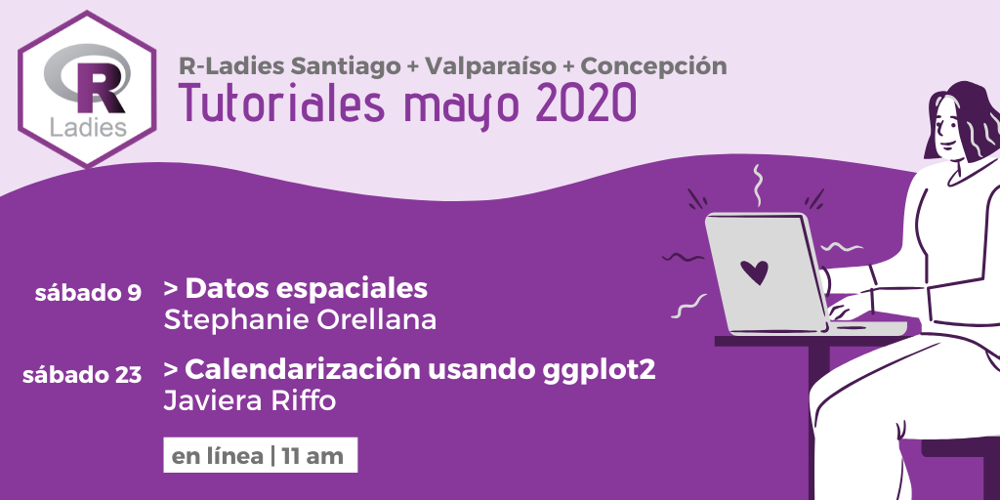

# Talleres temáticos | mayo 2020

## sábado 9: Datos espaciales
Taller a cargo de [Stephanie Orellana](https://twitter.com/sporella)

* [Presentación](https://sporella.github.io/datos_espaciales_presentacion)
* [Materiales](https://github.com/sporella/datos_espaciales_tutorial)
* [Video](https://vimeo.com/416759165)

## sábado 23: Calendarización usando ggplot2
Taller a cargo de Javiera Riffo
